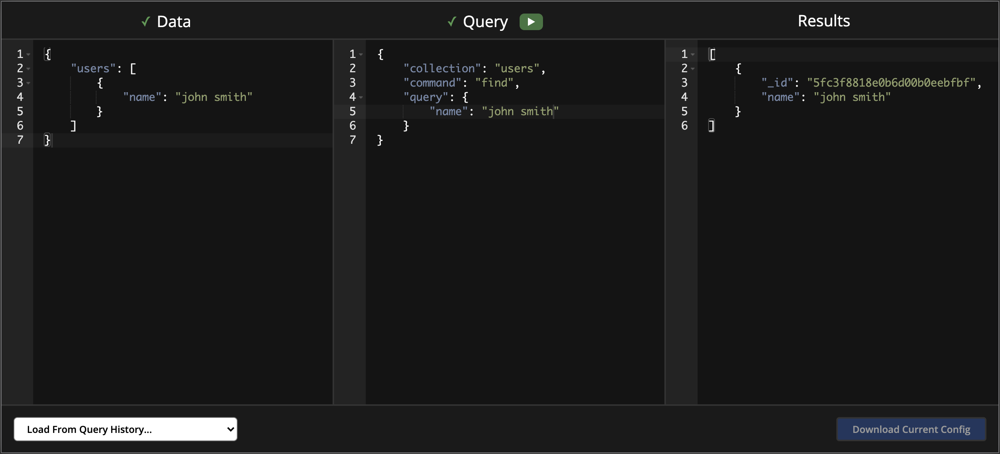

# MongoBox

Containerized MongoDB instance and web sandbox.

## Quick Start

To start, Docker is required to run the environment, you will also need Binci which can be installed via `npm i binci -g`.

Once both prerequisites are installed run `binci install && binci dev`. This will spin up the environment with the MongoDB instance running and start the web client running on `http://localhost:8000`.
